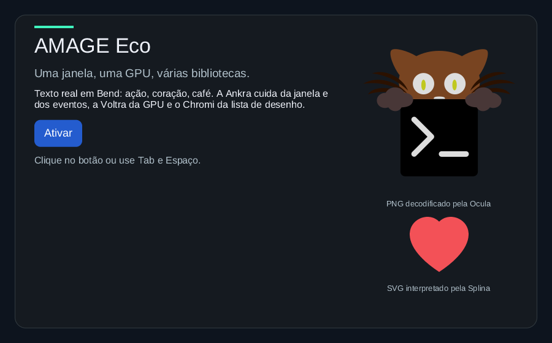

# Ankra

**Windows, input events, and application lifecycle in Bend 2.**

Ankra is the platform foundation of the AMAGE UI ecosystem. It owns the native
window, turns the system's events into ordered input, and runs the application
loop: draw only when something changed, sleep while nothing does, and hand the
final state back when the window closes. The library is written in Bend 2; the
only native code is a thin, documented bridge of Xlib calls.

**Status:** early Linux implementation, tested with **Bend 2.0.35** on
X11/XWayland (Hyprland 0.56). The first priority is a polished, reliable
experience on the development Linux machine. Compatibility layers will follow
proven progress.



The capture above is the integrated demo
([Chromi](https://github.com/amage-si/chromi)'s `examples/eco`): Ankra owns
the window and its events, [Voltra](https://github.com/amage-si/voltra)
presents on the GPU, Chromi draws the frame. Only the demo window was
captured (`grim -T`).

## Two backends

| Backend | Files | Use |
| --- | --- | --- |
| **Native X11** | `window.bend`, `app.bend`, `keys.bend`, `native.bend`, `native/` | The window GPU-presented apps use: real resize, window focus, position, close, an event wait that sleeps, and the native handle for a Vulkan surface. Linux, X11 or XWayland. |
| Official runtime | `main.bend` | Bend's own `Window` effect: a fixed-size window that presents a `Base.Image` with `XPutImage` every frame at 60 Hz. Kept as the portable fallback: it is the only window on the JS lane and on macOS (Metal), and it needs no GPU. |

## What works today (native backend)

- A window created, titled, classed and mapped with explicit size hints
  (resizable with a minimum, or fixed), optionally with a server-painted
  background (none for GPU windows, so the server never clears a frame).
- Ordered events, decoded in Bend from the bridge's words: `Resized`,
  `Moved` (screen position), `Focused` (window focus in/out, filtered as
  other toolkits do: grab and pointer/inferior changes ignored), `Exposed`,
  `Shown`, `CloseRequested`, `KeyDown` with a `repeat` flag and modifier
  bits, `KeyUp`, `PointerMoved` (consecutive motions coalesced),
  `PointerDown`/`PointerUp` (Base's button numbering), `PointerEntered`,
  `PointerLeft` and `Wheel`. Key codes follow Base's convention, so code
  written for the official window reads the same numbers.
- Text input: `TextTyped{text}` after each key press that types, through
  Xlib's built-in input method, so dead keys, compose sequences and AltGr
  levels work with any XKB layout (br-abnt2 here: `´ a` is á, AltGr+q is
  /). Controls and Ctrl/Alt/Super shortcuts are not text; the policy is in
  Bend.
- The clipboard (`clipboard.bend`): copy (own CLIPBOARD and answer
  TARGETS, UTF8_STRING, STRING and TEXT requests) and paste (the owner's
  answer arrives as `Clipboard{Pasted{text}}`), with a pure `answer`
  policy; it interoperates with X and, through XWayland, Wayland clients.
- Key repeat without guesswork: XKB detectable autorepeat when the server
  offers it (XWayland does), and collapsing of release+press pairs with one
  timestamp when it does not.
- `wait(win, ms)`: 0 polls, any timeout, or no deadline. The wait parks on the
  X connection inside Bend's event loop: no thread spins, no timer fires.
- `app.run`: draws when the content is stale, waits without a deadline when
  nothing is owed, or until the app's own deadline (`Sleep`), and returns the
  final window and state on a close request or `Stop`.
- `native(win)`: the Xlib `Display*` and window id for a GPU surface, on a
  dedicated presentation connection (see [the bridge](docs/bridge.md#why-two-connections)).

How it was verified on the development machine:

- **61 native checks** (`tests.bend`, no display needed): the official
  loop's batching and bounds, and the native backend's decoding of event
  words (configure, focus filtering, keys and repeats, text records and
  their policy, clipboard records, buttons, wheel, motion coalescing,
  expose, map, close), key codes and modifiers, the clipboard's answer
  policy, and the loop's decisions.
- **Real window** (`examples/native.bend`, events printed): a resize by the
  window manager arrived as `resized 640x400`, moves as `moved to 200,150`,
  focusing the window and focusing another one as `focus in`/`focus out`,
  the window manager's close as `close requested`; exit 0 with 0 native
  objects left.
- **Text and clipboard** (`examples/native.bend`, br-abnt2 keymap,
  `XMODIFIERS=@im=fcitx` in the environment): keys sent to the window with
  XSendEvent (`xdotool key --window`) and, with the window focused, with
  XTest (`xdotool key`) printed `text "á"` for `´ a`, `text "ã"` for
  `~ a`, `text "ç"`, `text "/"` for AltGr+q, `text "õ"` and `text "é"`.
  Ctrl+C took the clipboard, and both `xclip -o` (X) and `wl-paste`
  (Wayland, through the compositor's bridge) printed `Ankra: ação`. After
  `wl-copy olá`, Ctrl+V printed `pasted "olá"` 1-2 ms after the request.
  Hyprland hands a Wayland clipboard to X clients only while an X window
  has focus: unfocused, the paste failed with 61.
- **Idle:** the native example waited 5 s with 0 CPU ticks and 0 wakeups of
  its only thread (3.6 MiB resident). With the input context created it still
  waited 5 s with 0 CPU ticks and 0 context switches. The integrated GPU demo waited 10 s
  with 0 frames and 0 wakeups of its main thread.
- **Input latency:** synthetic clicks and keys sent to the window were
  handled at once with the dedicated presentation connection; with a single
  connection shared with the Vulkan driver they waited about 0.8 s for some
  later event (the reason for the second connection).

## Quick start

Requirements: the [Bend 2 toolchain](https://bend-lang.com), Clang 14 or newer,
X11 development headers/libraries (libX11, which also provides XKB), and an
X11 display, directly or through XWayland.

```sh
git clone https://github.com/amage-si/ankra.git Ankra
cd Ankra
export BEND_NO_TELEMETRY=1
bend version
mkdir -p build
bend tests.bend -o build/tests
./build/tests --threads 2 --gpu off
```

The native window without a renderer prints every event it receives:

```sh
bend examples/native.bend -o build/native
./build/native --threads 2 --gpu off
```

Resize it, move it, focus other windows, then close it normally (or press
Escape). `examples/window.bend` is the official-runtime example (click to
switch colors).

## The native contract

```bend
import Base
import ./Ankra/window.bend as A
import ./Ankra/app.bend as Loop

def update(win: A.Win, events: List<&2, A.Input>, s: State) -> IO(Loop.Step<State>):
  ...   # Keep{s}, Redraw{s}, Sleep{s, ms} or Stop{s}

def draw(win: A.Win, s: State) -> IO(Loop.Step<State>):
  ...   # Keep{s} when done, Redraw{s} when another frame is owed

def main() -> IO(Unit):
  do IO<Unit>:
    +win : A.Win <- IO.try(A.Win, A.open(A.options("Hello", 640, 400)))
    end : A.Win & State <- Loop.run(~State, ~update, ~draw, win, initial())
    ...   # tear down GPU objects, then A.close(window)
```

| Decision | Behavior |
| --- | --- |
| `Keep{state}` | Nothing new to show; wait without a deadline. |
| `Redraw{state}` | The content changed: `draw` runs before the next wait. |
| `Sleep{state, ms}` | Nothing new to show, but wake within `ms` (timers, another event source). |
| `Stop{state}` | End the loop. |

A batch with `CloseRequested` ends the loop after `update` has seen it. `run`
returns the window and the final state; destroy GPU surfaces made from the
window, then `A.close(win)`. Read the [API reference](docs/api.md) and the
[bridge reference](docs/bridge.md).

## The native bridge

`native/ankra.c` (920 lines, 675 non-blank and non-comment) with its
JS twin (`native/ankra.js`, which answers ENOTSUP) exposes **18 effects**:
one Xlib call each (or one protocol step), or a field-by-field translation
of an Xlib event into words: `x11_connect`, `x11_create`, `x11_protocols`,
`x11_title`, `x11_class`, `x11_size_hints`, `x11_autorepeat`, `x11_map`,
`x11_position`, `x11_native`, `x11_wait`, `x11_input`, `x11_clip_own`,
`x11_clip_reply`, `x11_clip_ask`, `x11_clip_take`, `x11_destroy`,
`x11_live`. Which events to select, which focus changes count, how keys map
to codes, which characters are text, what a clipboard request gets, when to
ask for the position, and how long to wait are decided in Bend.

## Current boundaries

- The native window has no CPU presenter: pair it with a GPU renderer
  (Voltra), or use the official backend for CPU images.
- X11/XWayland only. Native Wayland, other platforms, multiple windows per
  display connection and monitor/scale discovery are not implemented.
- Text input uses Xlib's local input method only: no IME server (fcitx,
  ibus), so no preedit and no candidate window for CJK input yet. Without
  an input method (an unsupported locale), text comes from keysyms and dead
  keys do not compose.
- Clipboard: CLIPBOARD and text only. No PRIMARY (middle-click paste), no
  INCR transfers (a paste over 4096 scalars fails, a copy over the server's
  request size is refused), no images or other types.
- No cursor shapes, no high-resolution scrolling (wheel notches only), no
  programmatic resize.
- `wait` watches the X connection only: an app with another event source
  (a socket) uses `Sleep` with a deadline.
- Window position is the one the window manager reports through X11; under a
  Wayland compositor that is the XWayland position the compositor assigns.
- Bend's checker reports `SOME PROOFS FAIL` for every def that reaches the
  foreign effects; that is expected for native code.

## Repository map

| Path | Purpose |
| --- | --- |
| [window.bend](window.bend) | Native window: options, open/close, events and their decoding, wait, native handle. |
| [app.bend](app.bend) | Application loop over the native window. |
| [clipboard.bend](clipboard.bend) | The CLIPBOARD selection: copy, paste, serving requests, the answer policy. |
| [keys.bend](keys.bend) | Key codes (Base's convention) and modifier bits. |
| [native.bend](native.bend), [native/](native/) | The X11 bridge's effect declarations, C implementation and JS twin. |
| [main.bend](main.bend) | Official-runtime backend: window lifecycle and loop over `Base.Window`. |
| [tests.bend](tests.bend) | Native checks that run without a display. |
| [examples/](examples/) | `native.bend` (native window, events printed), `window.bend` (official window). |
| [probe.bend](probe.bend) | Direct Base window probe for backend diagnostics. |
| [docs/](docs/) | API and bridge references. |

## Direction

Next: one wait over several event sources, IME (fcitx through XIM, with
preedit), scale discovery, and native Wayland. Each capability needs a working Linux example and measured
behavior before broader platform support. These are goals, not supported
features.

See [CONTRIBUTING.md](CONTRIBUTING.md) for development rules. The API is
experimental and may change. Licensed under either of [Apache License 2.0](LICENSE-APACHE) or [MIT](LICENSE-MIT), at your option.

## License

Licensed under either of

- Apache License, Version 2.0 ([LICENSE-APACHE](LICENSE-APACHE))
- MIT license ([LICENSE-MIT](LICENSE-MIT))

at your option. Unless you explicitly state otherwise, any contribution
intentionally submitted for inclusion in this work, as defined in the
Apache-2.0 license, shall be dual licensed as above, without any additional
terms or conditions.
